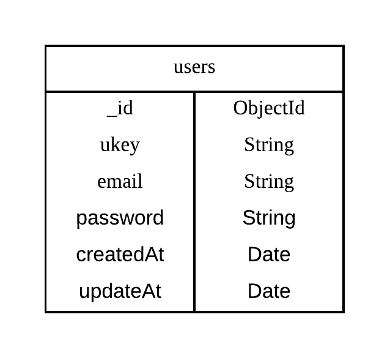

# User Collection Structure

&thinsp;

# How to Run

1. Create .env file with .env.sample content && change the env you want

2. use make cmd to run the applocation
   
        $ make run
    or

        $ make denon

---
__Get Mockup Data__

    $ curl localhost:4000/user/mockup | jq

__Get All Users__

    $ curl -H "Authorization: Bearer ${YOUR-TOKEN}" http://localhost:4000/user/all | jq

__Get User By ukey__

    $ curl -H "Authorization: Bearer ${YOUR-TOKEN}" http://localhost:4000/user/${ukey} | jq

__Create new User__

    $ curl -X POST -H "Content-Type: Application/json" -d '{"email": "sam.leung@test.com", "password": "12345678"}' http://localhost:4000/user/register | jq

__Login__

    $ curl -X POST -H "Content-Type: Application/json" -d '{"email": "sam.leung@test.com", "password": "12345678"}' http://localhost:4000/user/login | jq

__Update User__

    $ curl -X PATCH -H "Content-Type: Application/json" -H "Authorization: Bearer ${YOUR-TOKEN}" -d '{"email": "sam.leung_update@test.com", "password": "12345678_update"}' http://localhost:4000/user/update/${ukey} | jq

__Delete User__

    $ curl -X DELETE -H "Authorization: Bearer ${YOUR-TOKEN}" http://localhost:4000/user/delete/${ukey} | jq